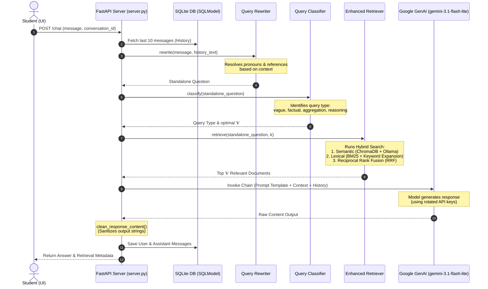
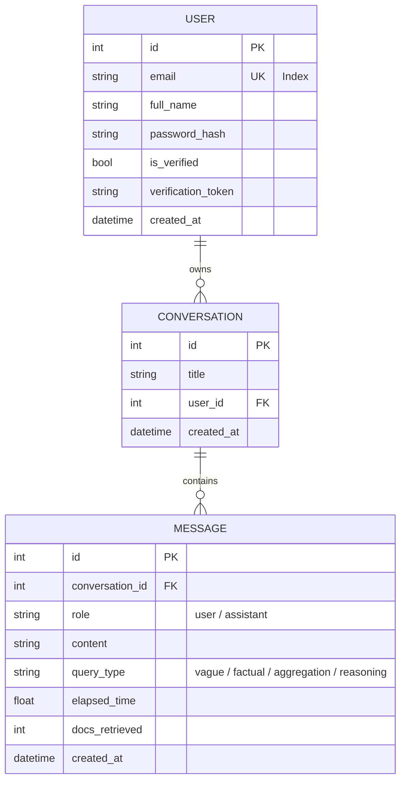
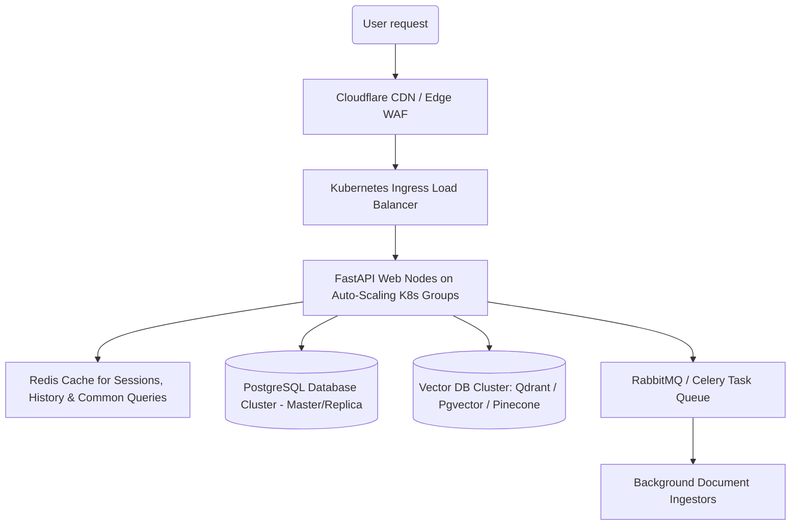

# JKKNIU Helpdesk Chatbot — Comprehensive Interview Preparation Guide

This guide is structured to help you ace your interview tomorrow. It provides a complete end-to-end technical overview, design justifications, architectural breakdowns, core code snippets, and 25+ high-probability mock interview questions with answers.

---

## 🗺️ Architectural Workflow

Below is the execution flow of a user message through the advanced RAG chatbot system:



---

## 📂 Project Directory Structure

```
├── backend/                    # Core Python Application & RAG Services
│   ├── server.py               # FastAPI Server (Routes, Session Management, CORS)
│   ├── main.py                 # CLI Chatbot Entry Point & Chatbot class
│   ├── query_enhancer.py       # Advanced Retrieval (BM25, RRF, Classifier, Rewriter)
│   ├── vector.py               # Vector DB Management & Ingestion pipeline (Ollama embeddings)
│   ├── database.py             # SQLModel Tables (User, Conversation, Message)
│   ├── auth_utils.py           # Security (JWT, Passwords, SMTP SSL/TLS fallbacks)
│   ├── config.py               # Constants, File Paths, and Toggle Flags
│   └── api_keys.py             # Google API Key Rotation logic
├── client/                     # Frontend SPA (React + TypeScript + Vite)
├── data/                       # Ingestion Knowledge Base (University text files & JSON data)
│   └── General/
│       ├── Q&A.txt             # Structured Q&A file
│       ├── structure_data.json # University structure overview
│       └── ingestion_registry.json # Tracks hashes of ingested documents
├── chromaDB/                   # Local Vector Store database (ChromaDB collection files)
├── evaluation/                 # G-Eval benchmark suite & results
│   ├── evaluator_advanced.py   # Runs 100-question automated G-Eval test suite
│   ├── adv_rag_result.json     # G-Eval metrics output
│   └── comparison_report.md    # Comparison of Baseline vs Advanced RAG
├── package.json                # Root orchestration (concurrent client + server development)
└── .env                        # Environment configurations
```

---

## 💾 Database Schema & ORM

The system uses **SQLModel** (which combines **Pydantic** for validation and **SQLAlchemy** for ORM) connected to a **SQLite** database (`backend/helpdesk.db`).

### 1. Database Schema Definitions


### 2. Architectural Database Justifications
*   **Why SQLite?** Perfect for standalone deployment, academic demonstration, and rapid development. It requires zero server setup, is self-contained in a single file (`backend/helpdesk.db`), and reads extremely fast for read-heavy operations like helpdesk usage.
*   **Why SQLModel?** Avoids double-definition of models. In traditional setups, you define a Pydantic schema for API requests/responses and a SQLAlchemy model for the database. SQLModel unifies them into a single class definition, reducing boilerplate code and ensuring absolute type safety across both API validation and database persistence layers.

---

## 🔑 Authentication, Security, and Communications

*   **Authentication & Authorization:** Implements **OAuth2 with Password Flow and JWT bearer tokens**. 
    *   Passwords are hashed securely using the **Bcrypt** algorithm.
    *   Access tokens have configurable expiration periods (`ACCESS_TOKEN_EXPIRE_MINUTES = 60`).
    *   FastAPI dependencies (`Depends(get_current_user)`) guard endpoints, verifying the JWT signature, claims, and matching the user in the database.
*   **SMTP Communication Failover:** Handles password resets and verification emails.
    *   **The Problem:** Different email service providers (Gmail, Outlook, custom SMTP) expect different security protocols depending on the port. Port `465` requires direct SSL, while port `587` requires a standard SMTP socket upgraded via `STARTTLS`.
    *   **The Solution:** The `auth_utils.py` module uses a dynamic fall-through connection strategy. It detects if port `465` is specified and establishes an `smtplib.SMTP_SSL` connection; for other ports, it sets up standard `smtplib.SMTP` and issues `server.starttls()` automatically.

---

## 🧠 Advanced RAG Pipeline Explained

Retrieval-Augmented Generation (RAG) updates the generation capabilities of LLMs with verified external data. The standard RAG pipeline (take query -> embed -> vector search -> generate) often fails for complex queries. Our system implements several **Advanced RAG** techniques:

### 1. Ingestion Pipeline & Registry Sync
*   **Chunking Strategy:** Documents are parsed recursively via `RecursiveCharacterTextSplitter` with a `chunk_size` of `2,000` characters and `chunk_overlap` of `400` characters. This ensures semantic context is preserved across splits.
*   **Hash-Based Registry Ingestor:** To prevent expensive re-embedding of unchanged documents, `vector.py` implements a registry scanner. It computes the **MD5 hash** of each file in the `data/` directory and logs it in `ingestion_registry.json`. On server boot or update:
    *   It recursively scans the `data/` directory, skipping standard build/system files (such as `.git`, `chroma`, `__pycache__`).
    *   It identifies new or modified files by comparing hashes.
    *   It splits and embeds *only* the new/modified documents in **batches of 50** chunks (to prevent connection timeouts and memory overhead).
    *   *Limitations:* ChromaDB does not support deletion by arbitrary metadata parameters natively without explicit ID tracking; therefore, deleting a file on disk does not automatically clean its chunks from the database unless a full collection rebuild is triggered.

### 2. Query Classification
*   **`QueryClassifier`**: Categorizes user inputs using regex patterns into:
    *   `vague`: (e.g., "tell me about", "hello", "info") -> Routes to higher retrieval contexts.
    *   `factual`: (e.g., "what is the email", "who is X") -> Focuses on precise semantic and keyword matches.
    *   `aggregation`: (e.g., "list all teachers", "most publications") -> Requests the highest document count (`k = 40`) and triggers sub-query generation.
    *   `reasoning`: (e.g., "can I do X if Y") -> Requests moderate document context.

### 3. Hybrid Search & Reciprocal Rank Fusion (RRF)
*   **The Limitation:** Semantic search (embeddings) understands concepts but struggles with exact names, emails, or short course codes. Keyword search (BM25) finds exact terms but lacks conceptual understanding.
*   **The Hybrid Solution:** We combine both:
    1.  **Semantic Search:** Vector retrieval using ChromaDB and local Ollama embeddings (`nomic-embed-text`).
    2.  **Keyword Search:** Lexical search using the BM25Okapi algorithm over the tokenized database documents.
    3.  **RRF Fusion:** Merges the two result lists using the Reciprocal Rank Fusion formula:
        $$\text{RRF Score}(d) = \sum_{m \in M} \frac{1}{k_{\text{rrf}} + \text{rank}_m(d)}$$
        where $k_{\text{rrf}}$ defaults to $60$. Documents appearing near the top of *both* lists get boosted.

### 4. Multi-Query Generation & Keyword Expansion
*   **Multi-Query:** For `aggregation` queries, a sub-chain prompts the LLM to write 2-3 simpler questions (e.g., "Who are the CSE teachers?" and "What are their publication counts?") to retrieve broader candidate documents.
*   **Keyword Expansion:** For factual/reasoning queries, the LLM extracts synonyms and contextual acronyms (e.g. "IU" -> "Islamic University") to augment the BM25 query, improving keyword search effectiveness.

### 5. Chat History Query Rewriting
*   To keep retrieval accurate for follow-up conversational queries (e.g., Student: "Who is the chairman of CSE?" -> Assistant: "Dr. Saiful Islam" -> Student: "What is **his** email?"), the `HistoryQueryRewriter` uses the LLM to rewrite the message into a standalone question: "What is the email of Dr. Saiful Islam JKKNIU?". This resolved standalone question is then embedded and retrieved.

### 6. HyDE (Hypothetical Document Embeddings)
*   **Why it's configured:** Vague queries ("admissions") embed poorly. HyDE generates a "fake" hypothetical answer snippet first (e.g., "JKKNIU Undergraduate Admission criteria for the session..."). The system then embeds this *hypothetical response* and performs similarity search, locating real documents containing actual matching answers.
*   *Note: In the configuration, we've set `USE_HYDE = False` by default to conserve latency, but it remains fully toggleable.*

---

## 🔑 LLM Selection & API Key Rotation

*   **Why Gemini 3.1 Flash Lite?** 
    *   **Low Latency & High Capabilities:** Extremely quick response generation with robust contextual understanding, ideal for conversational agents.
    *   **Cost-Efficient Quota Limits:** Offers **15 RPM** (Requests Per Minute) and **500 RPD** (Requests Per Day) under the free tier, vastly outperforming models like Gemini 2.5 Pro or Flash (which cap at 20 RPD on free tiers).
*   **API Key Rotation Factory (`api_keys.py`):**
    *   **Problem:** Single free-tier API keys easily hit Rate Limits (429 errors).
    *   **Solution:** Reads `GOOGLE_API_KEY` from `.env` as a JSON array of multiple developer keys. The system rotates the key sequentially using a round-robin cursor (`(current_index + 1) % len_keys`) on every LLM generation request, multiplying the active rate limit threshold.

---

## 📈 Evaluation Framework (LLM-as-a-Judge)

The chatbot's performance is monitored using a **G-Eval** inspired benchmark suite in `evaluation/evaluator_advanced.py`.
*   **Evaluation Dataset:** 100 test questions covering Factual, Aggregation, Reasoning, and Vague categories.
*   **Scoring Rubric:** A separate evaluation LLM (`EVALUATION_MODEL`) rates generated answers on a scale from 1 to 5 against a gold-standard reference answer:
    *   **5 stars:** Perfect match, accurate and complete.
    *   **4 stars:** Mostly accurate with minor missing details.
    *   **3 stars:** Partially correct but missing important information.
    *   **2 stars:** Significant inaccuracies or incomplete.
    *   **1 star:** Wrong or completely off-topic.
*   **Results:** The output is saved to `adv_rag_result.json`, tracking average ratings, latency, and token counts.

---

## 🚀 Scalability & Future Improvements

If asked **"How would you scale this to millions of users?"**, present this plan:



1.  **Database Migration:** Move from SQLite to a highly available SQL cluster (e.g., **PostgreSQL** with replicas) for storing user credentials and message logs.
2.  **Vector DB Migration:** Replace local ChromaDB with a distributed vector database like **Qdrant** or **pgvector** running in-database, supporting distributed indexes (HNSW) and partitioning.
3.  **Decouple Ingestion:** Offload vector DB scanning and document embedding to background workers using a message queue (**RabbitMQ** or **Redis**) and a celery task pipeline.
4.  **Semantic Caching:** Introduce **Redis** to cache user session history and implement semantic caching (caching exact/very similar query responses) to reduce costly LLM API invocations.
5.  **Hosting & Load Balancing:** Containerize with Docker and orchestrate on **Kubernetes (K8s)**, scaling web pods horizontally based on CPU/Memory and HTTP load metrics.

---

## 💻 Crucial Code Snippets

### 1. Reciprocal Rank Fusion (RRF) Logic (`query_enhancer.py`)
This is how we merge Semantic (embeddings) and Lexical (BM25) search rankings mathematically:
```python
def reciprocal_rank_fusion(
    self,
    semantic_results: List[Tuple[Document, float]],
    keyword_results: List[Tuple[Document, float]],
    k: int = 60
) -> List[Document]:
    doc_scores = {}
    
    # RRF Formula: score = sum( 1 / (k + rank_index) )
    for rank, (doc, _) in enumerate(semantic_results):
        doc_id = doc.page_content[:100]  # Unique identifier prefix
        if doc_id not in doc_scores:
            doc_scores[doc_id] = {"doc": doc, "score": 0}
        doc_scores[doc_id]["score"] += 1 / (k + rank + 1)
    
    for rank, (doc, _) in enumerate(keyword_results):
        doc_id = doc.page_content[:100]
        if doc_id not in doc_scores:
            doc_scores[doc_id] = {"doc": doc, "score": 0}
        doc_scores[doc_id]["score"] += 1 / (k + rank + 1)
    
    # Sort documents in descending order of fused scores
    sorted_docs = sorted(doc_scores.values(), key=lambda x: x["score"], reverse=True)
    return [item["doc"] for item in sorted_docs]
```

### 2. Dynamic SMTP Mail Delivery Connection Fallback (`auth_utils.py`)
This snippet establishes connection fallbacks for SSL (port 465) and TLS/STARTTLS (port 587):
```python
def send_email_message(msg):
    # Determine the connection security type based on PORT
    if int(MAIL_PORT) == 465:
        # SSL encryption required from connection start
        server = smtplib.SMTP_SSL(MAIL_SERVER, MAIL_PORT, timeout=10)
    else:
        # Standard SMTP connection, upgraded to TLS
        server = smtplib.SMTP(MAIL_SERVER, MAIL_PORT, timeout=10)
        server.starttls()
        
    server.login(MAIL_USERNAME, MAIL_PASSWORD)
    server.send_message(msg)
    server.quit()
```

### 3. API Key Rotation Utility (`api_keys.py`)
```python
_api_keys = ["key1", "key2", "key3"]
_current_key_index = 0

def get_next_api_key() -> str:
    global _current_key_index
    if not _api_keys:
        raise ValueError("No API keys loaded.")
    
    # Round-robin selection
    key = _api_keys[_current_key_index]
    _current_key_index = (_current_key_index + 1) % len(_api_keys)
    return key
```

---

## 🙋 Mock Interview Questions & Answers

### General Architecture
#### Q1: Can you give an executive summary of this project?
**A:** This is a professional RAG-based university helpdesk chatbot built specifically for *Jatiya Kabi Kazi Nazrul Islam University (JKKNIU)*. It helps students query academic regulations, course information, and faculty details. Architecturally, it consists of a FastAPI backend and a React/TypeScript frontend. It utilizes a hybrid vector-lexical retrieval pipeline (ChromaDB + BM25) and applies query-expansion and rewriting heuristics prior to prompting a Gemini 3.1 Flash Lite LLM, ensuring highly accurate responses.

#### Q2: What were the most critical architectural decisions you made, and why?
**A:** 
1. **Hybrid Retrieval with Reciprocal Rank Fusion (RRF):** Unifies conceptual embedding matches (semantic) with term-exact matches (BM25 lexical), ensuring course codes and teacher names are never missed.
2. **SQLModel for Unified Schema:** Eliminated data schema double-definition by merging database models (SQLAlchemy) and API payloads (Pydantic).
3. **Round-Robin API Rotation:** Multiplied rate-limits under Gemini's free tier using sequential key swapping.

#### Q3: Why did you choose Python for the backend and JavaScript/TypeScript for the frontend?
**A:** Python is the industry standard for AI, NLP, and RAG pipelines because of libraries like LangChain and rich database hooks. TypeScript and React were chosen for the client to provide a strongly typed, componentized, reactive UI, preventing runtime errors in complex data states.

---

### Database & ORM
#### Q4: Why did you use SQLite? What are its limitations in a production environment?
**A:** SQLite was chosen because it requires zero server setup, is self-contained in a single database file (`helpdesk.db`), and reads extremely fast. However, it lacks support for high write concurrency (it locks the entire database for writes), does not support horizontal scaling, and lacks robust distributed clustering features.

#### Q5: What is an ORM, and why did you use SQLModel instead of raw SQL queries?
**A:** Object-Relational Mapping (ORM) lets you interact with a database using native programming language classes/objects instead of writing raw SQL strings. SQLModel was selected because it unifies Pydantic and SQLAlchemy. This guarantees that validation schemas and database structures are declared in a single source of truth, reducing bugs and typing mismatches.

#### Q6: Explain the database relationship between User, Conversation, and Message in your SQLModel declaration.
**A:** It is a 1-to-Many hierarchy. A `User` can own many `Conversations` (linked via `user_id` foreign key). A `Conversation` can contain many `Messages` (linked via `conversation_id` foreign key). Relationships are defined using SQLModel's `Relationship(back_populates=...)` for bidirectional ORM attributes.

---

### Security & Authentication
#### Q7: How is user password security handled in the system?
**A:** We never store raw passwords. We use `passlib` with the **Bcrypt** hashing algorithm. Bcrypt incorporates a random salt and a configurable work factor (computational difficulty) to protect passwords against rainbow tables and brute-force cracking.

#### Q8: What is JWT? How does your authorization flow work?
**A:** JSON Web Token (JWT) is a compact, URL-safe container for signing claims. When a user logs in successfully, the backend creates a signed JWT containing their email and expiration. The frontend stores this token and sends it in the `Authorization: Bearer <token>` header for protected requests. The backend decodes it, verifies the signature using a `SECRET_KEY`, and retrieves the user context.

#### Q9: What is the difference between SSL (Port 465) and TLS/STARTTLS (Port 587)? How does your code handle both?
**A:** Port 465 requires establishing an encrypted SSL socket from the very beginning (`smtplib.SMTP_SSL`). Port 587 begins as an unencrypted connection that must be upgraded to secure encryption via the `STARTTLS` command (`smtplib.SMTP` followed by `server.starttls()`). Our code dynamically inspects `MAIL_PORT` and implements fallbacks for both pathways to guarantee delivery across any SMTP provider configuration.

---

### Retrieval-Augmented Generation (RAG)
#### Q10: What is RAG, and why is it better than just asking the LLM directly?
**A:** RAG stands for Retrieval-Augmented Generation. Instead of relying solely on the LLM's static training data (which can lead to hallucinations and lacks private university documents), RAG finds relevant document snippets in a private knowledge base (ChromaDB) and feeds them into the prompt context. This ensures that the model outputs factually accurate, up-to-date responses grounded in verified sources.

#### Q11: What is a Vector Database? What is ChromaDB, and why did you choose it over others (like Pinecone, pgvector)?
**A:** A Vector Database index vectors (embeddings) generated from text and performs high-speed mathematical similarity searches (like Cosine Similarity). ChromaDB was selected because it is open-source, highly lightweight, runs completely in-memory/on disk locally, and integrates with LangChain. While Pinecone is cloud-only (introducing network latency and costs) and pgvector requires full Postgres setup, Chroma is ideal for quick-deployment systems.

#### Q12: Explain the concept of Embeddings.
**A:** An embedding is a high-dimensional vector of floating-point numbers that represents the semantic meaning of a word or document. Semantically similar texts are mapped close to each other in this high-dimensional vector space.

#### Q13: What chunking strategy did you use for document ingestion? Why did you use an overlap?
**A:** We split text files recursively using `RecursiveCharacterTextSplitter` with `chunk_size = 2,000` and `chunk_overlap = 400`. The overlap ensures that sentences or context split at a boundary aren't lost, keeping semantic transitions intact.

#### Q14: How does your ingestion pipeline avoid processing files that haven't changed?
**A:** We use a hash-based registry (`ingestion_registry.json`). When the ingestion script runs, it computes the **MD5 hash** of each text document in the `/data` folder and compares it with the registry. If the hash matches, the document is skipped. If it is new or modified, it splits the text and embeds the chunks.
*Note: A current limitation of our ChromaDB integration is that deletions on disk are not synced automatically to delete vectors because Chroma does not easily support query-based deletion by metadata source without tracking unique document chunk IDs. This would require rebuilding the database or adding a custom ID-tracking lookup.*

---

### Advanced Query Processing
#### Q15: What is Hybrid Search, and how does Reciprocal Rank Fusion (RRF) combine them?
**A:** Hybrid Search runs semantic search (embedding similarity) and lexical search (BM25 keyword matching) in parallel. RRF combines these results by scoring documents based on their position in both lists. The score is calculated as $RRF(d) = \sum \frac{1}{60 + \text{rank}}$. The highest-scoring merged documents represent the best match of conceptual intent and exact keyword matches.

#### Q16: Explain HyDE (Hypothetical Document Embeddings) and when it is useful.
**A:** HyDE prompts the LLM to generate a hypothetical answer to the user's query first. The system then embeds this *hypothetical document* and uses it to search the vector database. This is useful for short or vague queries where the query itself has very few keywords in common with the target documents.

#### Q17: What is Multi-Query retrieval, and when is it triggered?
**A:** Multi-Query prompts the LLM to write 2-3 variations of a complex query. This is triggered by our `QueryClassifier` for `aggregation` queries. Running multiple query variations retrieves a broader set of candidate documents, ensuring the LLM receives all the context needed for multi-step reasoning.

#### Q18: What is Chat History Query Rewriting, and why is it necessary?
**A:** In chat interfaces, students use pronouns and short follow-ups (e.g. "What is his email?"). An embedding model cannot resolve "his" without context. Query Rewriting prompts the LLM to rewrite the message into a standalone question (e.g., "What is the email of Professor Dr. X?") using the recent conversation history before retrieval occurs.

---

### LLM & Prompt Engineering
#### Q19: Why did you choose Gemini 3.1 Flash Lite over other LLMs?
**A:** Gemini 3.1 Flash Lite offers strong performance with low latency. More importantly, its free-tier rate limits (15 RPM and 500 RPD) are much more generous than standard models (which cap at 20 RPD), making it the most cost-effective model for active development.

#### Q20: What is API Key Rotation, and how did you implement it?
**A:** To bypass free-tier rate limits, we load a list of multiple Google API keys from a JSON array in the `.env` file. We implement a round-robin cursor factory (`get_next_api_key()`) that rotates to the next key on every LLM generation request, multiplying our total request limit.

#### Q21: What are the main components of your prompt templates?
**A:** Our prompts use a step-by-step layout:
1.  **Role Definition:** "Helpdesk assistant for JKKNIU."
2.  **Context Injection:** Current date, time, and conversation history.
3.  **Retrieved Knowledge:** Retrieved database snippets.
4.  **Formatting Rules:** Guardrails like "speak from internal knowledge, do not cite files, and don't greet the user unless it's a new session."

---

### Evaluation & Tooling
#### Q22: What is LangChain, and how did you use it?
**A:** LangChain is a framework for building applications with LLMs. We use it to chain prompts, LLMs, and retrieval steps together, configure model integrations (Google GenAI, Ollama), and manage document chunking and vector storage interfaces.

#### Q23: What is LangSmith, and how is it enabled?
**A:** LangSmith is a platform for debugging, testing, and monitoring LLM applications. It is enabled via environment variables (`LANGCHAIN_TRACING_V2=true`). It logs trace traces of our RAG pipelines, helping us visualize prompt inputs, retrieval scores, and LLM latencies.

#### Q24: What is G-Eval, and how does your evaluation script work?
**A:** G-Eval uses an LLM-as-a-judge to evaluate generation quality. Our script runs a benchmark dataset of 100 questions. A separate evaluation LLM rates the chatbot's answers from 1 to 5 against reference answers based on accuracy, alignment, and completeness.

---

### System Refactoring
#### Q25: How did you fix path dependency issues in this codebase?
**A:** Originally, scripts failed if run from different working directories. We refactored `config.py` to dynamically compute `ROOT_DIR` using the absolute file path of the config file itself (`os.path.abspath(__file__)`). All paths (for SQLite and ChromaDB) are resolved relative to this root, ensuring path-independence.

#### Q26: What was the issue with the "forgot password" flow, and how did you debug it?
**A:** 
1.  **Empty DB Migration:** Structural changes created a new empty database file in the backend folder. The forgot-password endpoint returned a success message but bypassed email delivery because the requested email address was not registered in the new DB. We resolved this by migrating the original sqlite database file (`helpdesk.db`) into the backend folder.
2.  **Unbuffered Logging:** Uvicorn logs were block-buffered by Python. We added the `-u` unbuffered flag to our runner commands to ensure all log traces are written to stdout instantly.
3.  **SMTP Connection Security:** We implemented dynamic fallbacks to support both SSL (port 465) and TLS (port 587) connections.

#### Q27: What was the issue with reasoning model outputs (like Gemma 4) returning list structures? How did you resolve it?
**A:** When using advanced reasoning models, Langchain's Google GenAI driver returns the LLM response parsed as a list of structured content blocks (e.g. separating the chain-of-thought blocks from the final output) rather than a flat string. 
This caused string operations like `.strip()` or `.replace()` to crash with `'list' object has no attribute ...` errors and raised `sqlite3.InterfaceError` database binding errors when committing message content. 
I resolved this by implementing a global `clean_response_content()` utility that inspects the return type, extracts text from the blocks, and joins them with newlines if it's a list, ensuring clean database-ready strings.
