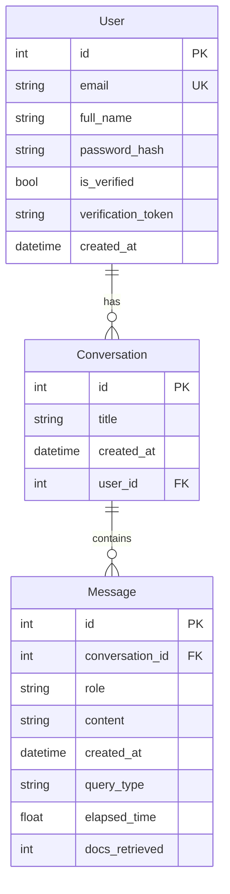

# JKKNIU Helpdesk — Project Summary

## Overview

JKKNIU Helpdesk is a university helpdesk chatbot built on an advanced Retrieval‑Augmented Generation (RAG) pipeline. It combines a Python FastAPI backend, a vector database for document retrieval, and a React + Vite frontend. The project includes CLI and API interfaces, evaluation scripts, and an automated data ingestion system that keeps the knowledge base in sync with the filesystem.

---

## How the Project is Set Up

### 1) Data and Knowledge Base

- **Source data** lives in the `data/` directory, organized by offices, departments, teachers, clubs, notices, and general info.
- **Ingestion registry** is stored in `data/General/ingestion_registry.json` to track file hashes and detect changes.
- **Vector store** is persisted in `chromaDB/` and updated via `backend/vector.py`.

### 2) Backend (Python & SQLModel)

- **FastAPI server** in `backend/server.py` handles authentication, chat, and conversation storage.
- **Authentication** uses JWT with email verification and password reset flows via `backend/auth_utils.py`.
- **Database layer** uses SQLModel for user, conversation, and message storage in `backend/database.py`.
- **RAG pipeline** lives in `backend/query_enhancer.py` and `backend/vector.py`, with a CLI-level orchestration in `backend/main.py`.

#### Database Schema
The SQLModel ORM defines three primary tables in the SQLite database (`backend/helpdesk.db`):

- **`User` Table**: Stores account details, authorization tokens, verification status, and timestamps.
- **`Conversation` Table**: Represents a chat thread belonging to a specific user.
- **`Message` Table**: Records individual messages within a conversation. Includes metadata for search diagnostic metrics (e.g., `query_type`, `elapsed_time`, `docs_retrieved`).

### 3) Frontend (React + Vite)

- **`client/`** (formerly `web-ui/`) provides the chat interface and uses a services API client (`client/src/services/api.ts`) to call backend endpoints.
- The UI includes chat metadata (query type, elapsed time, docs retrieved) and theme toggles.

### 4) Evaluation Suite

- **`evaluation/`** contains scripts and datasets to benchmark baseline vs enhanced RAG for factual, aggregation, reasoning, and vague queries. All scripts have been updated to resolve backend imports using the path-independent `backend/` module layout.

---

## Advanced RAG Techniques Used

The project goes beyond basic vector retrieval with multiple enhancements:

### 1) Query Classification

**What it does:** Categorizes queries into `factual`, `aggregation`, `reasoning`, and `vague`.
**Why it matters:** Different query types need different retrieval strategies. For example, aggregation questions require more documents than simple fact lookups.

### 2) HyDE (Hypothetical Document Embeddings)

**What it does:** Generates a synthetic document snippet that likely answers the question, then retrieves real documents using that generated text.
**Why it matters:** For vague or poorly worded queries, a hypothetical answer often provides better semantic retrieval cues.

### 3) Multi‑Query Decomposition

**What it does:** Breaks complex questions into multiple sub‑queries and retrieves for each one.
**Why it matters:** Aggregation questions often require multiple perspectives or sources. This increases recall.

### 4) Hybrid Retrieval (Semantic + Keyword)

**What it does:** Combines embedding similarity search with BM25 keyword search, then fuses results using Reciprocal Rank Fusion (RRF).
**Why it matters:** Semantic search is great for meaning, while BM25 is strong for exact keywords and names. The fusion improves both precision and recall.

### 5) Keyword Expansion

**What it does:** Generates additional search keywords using the LLM to improve BM25 results.
**Why it matters:** University data often includes abbreviations and variants (e.g., “CSE” vs “Computer Science and Engineering”). Expanded keywords catch these.

---

## Design Patterns Used (Theory + Why Here)

### 1) Singleton (Module‑Level Instance)

**Theory:** A Singleton ensures only one instance of a class exists and provides a global access point to it.
**Where in project:** `ingestor = DataIngestor()` in `backend/vector.py`.
**Why needed here:**

- The ingestion registry and vector store should be initialized only once.
- Ensures consistent state across imports and prevents re‑indexing from multiple instantiations.
  **Benefit:** Efficient resource usage and consistent data synchronization.

### 2) Factory

**Theory:** A Factory encapsulates object creation so callers don’t depend on construction details.
**Where in project:** `get_enhanced_retriever()` in `backend/query_enhancer.py`.
**Why needed here:**

- Multiple feature flags (HyDE, multi‑query, hybrid, keyword expansion) create many possible configurations.
- Centralizes creation logic so callers stay simple.
  **Benefit:** Easier to maintain and scale retrieval configurations.

### 3) Strategy (Runtime Behavior Selection)

**Theory:** The Strategy pattern selects an algorithm at runtime based on context.
**Where in project:** `EnhancedRetriever.retrieve()` in `backend/query_enhancer.py` selects techniques based on `QueryClassifier` output.
**Why needed here:**

- Different query types need different retrieval depths and techniques.
- Avoids a one‑size‑fits‑all pipeline.
  **Benefit:** Better answer quality and faster responses by choosing the most suitable path.

### 4) Dependency Injection (Framework‑Managed)

**Theory:** Dependencies are provided to a component rather than created within it.
**Where in project:** FastAPI’s `Depends()` injects DB sessions and authenticated users in `backend/server.py`.
**Why needed here:**

- Keeps endpoint logic focused on business concerns, not construction of dependencies.
- Enables easier testing and swapping of implementations.
  **Benefit:** Cleaner architecture, improved testability, and modularity.

---

## Why These Patterns Matter in This Project

- The RAG stack is resource‑intensive. Reusing instances (Singleton) and configuring them via factories avoids costly re‑initialization.
- Retrieval needs to adapt per query type. Strategy ensures the system is responsive and accurate across question categories.
- The API layer handles user data and security. Dependency Injection enforces clean boundaries between authentication, DB access, and endpoint logic.

Together, these patterns keep the codebase scalable, efficient, and easier to evolve as new data sources and RAG techniques are added.
